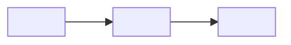

<!--
Fill-in-the-blank README skeleton for the readme-format skill.
Delete any section that doesn't carry real weight for this project —
this is a menu, not a mandatory checklist. Everything in <angle brackets>
must be replaced with something real and verifiable from this repo,
never left as a placeholder or a guessed number.
-->

<div align="center">

<!-- Hero image / banner, optional but recommended. Skip if you have none — do not use a stock/generic image. -->
" alt="<Project> — <one-line tagline>" width="100%" />

[](<ci-workflow-url>)
[](<ci-workflow-url>)
[](LICENSE)
[](<live-url>)
[](<stack-doc-url>)
<!-- Add a demo-video badge only if a real video exists: -->
[](<video-url>)

### <One bolded sentence that reframes the problem, not just describes the feature.>

<One-paragraph pitch: what it is, the mechanism, the trigger condition.>

**[ ▶ Watch the demo ↗ ](#watch-the-demo)** · **[ Live app ↗ ](<live-url>)** · **[ Judge this in 90 seconds ↗ ](#judge-it-in-90-seconds)** · **[ The core proof ↗ ](#the-core-proof)**

</div>

---

## Watch the demo

<div align="center">

<a href="<video-url>">
  " alt="<Project> demo" width="760" />
</a>

**[ ▶ <one-line description> — <mm:ss> ↗ ](<video-url>)**

</div>

| | |
|---|---|
| [0:00](<video-url>?t=0) | **<beat 1>** |
| [<mm:ss>](<video-url>?t=<seconds>) | **<beat 2>** |
| [<mm:ss>](<video-url>?t=<seconds>) | **<beat 3>** |

<One paragraph stating the footage is real, and naming the exact number(s) to watch for.>

---

## Judge it in 90 seconds

**Live: [<host>](<live-url>)** — <one honest line on what's live vs. a static snapshot, if relevant>.

| | |
|---|---|
| **<N>** | <what this number means> |
| **<N>** | <what this number means> |
| **<cost/time>** | <what this number means> |

```bash
<the fewest real commands that let a reviewer verify the core claim themselves>
```

---

## Table of contents

<!-- Only include this once the doc has 6+ top-level sections. -->
- [Watch the demo](#watch-the-demo)
- [The core proof](#the-core-proof)
- [The problem](#the-problem)
- [What was built](#what-was-built)
- [Architecture](#architecture)
- [Honesty: limitations](#honesty-limitations)
- [Run it locally](#run-it-locally)

---

## The core proof

> <The one-sentence request/scenario that triggers the behavior you're proving, as a quote if it's a literal prompt.>

```text
<verbatim, real output — a blocked run, a diff, a tx hash, a terminal session.
Keep it raw, not reformatted into a tidy table — reformatting invites the
suspicion it was written after the fact.>
```

<Prose narrating the same output back to the reader, part by part, explaining
what each piece means and why it matters.>

---

## The problem

<Short prose. State it the way a frustrated user feels it, not the way a spec describes it.>

---

## What was built

1. **<Component A>** — <one sentence>.
2. **<Component B>** — <one sentence>.

**<One bolded sentence naming the end-to-end loop connecting them.>**

---

## Architecture



| <File/module> | <Role> |
|---|---|
| `<path>` | <what it does> |

<!-- Verify every node/edge label against the current code before publishing. -->

---

## How it decides

1. **<Step 1>** — <what happens>.
2. **<Step 2>** — <what happens>.

| Situation | Outcome |
|---|---|
| <case> | <result> |

---

## Engineering decisions

- **<Decision, bolded>.** <Why, in one or two sentences — the alternative you didn't take and why.>

---

## Integrity: what's staged vs. real

<!-- Include only if any part of the demo used a deliberately planted bug,
seeded data, or a scripted scenario. -->

<Name the exact commit/line that was staged. State plainly that everything
downstream is real and reproducible, and where the evidence for that lives
in the repo.>

---

## Live product surface

| Route | What it shows |
|---|---|
| `<path>` | <description> |

---

## Honesty: limitations

- **<Limitation, bolded>.** <What's not handled, and why that's an acceptable scope line, not an oversight.>

See [`docs/LIMITATIONS.md`](docs/LIMITATIONS.md) for the full list.

---

## Tech stack

- **<Layer>:** <real packages, pinned versions where that was deliberate>

---

## Project layout

```text
<real, current directory tree with one-line comments — regenerate before publishing>
```

---

## Run it locally

```bash
git clone <repo-url> && cd <repo>
<install command>
<run command>                  # <url>

# Required checks
<lint> && <typecheck> && <test> && <build>
```

---

## Tests

```bash
<test command>
```

<One line on what's tested against a real dependency vs. a fake/mock, and
what specifically never runs against a fake.>

---

## Attribution

**<Category>** — [<Tool/Library>](<url>) (<license if applicable>).

<If an AI coding agent was used to build this, say so here plainly.>

---

## License

<LICENSE> — see [LICENSE](LICENSE).
