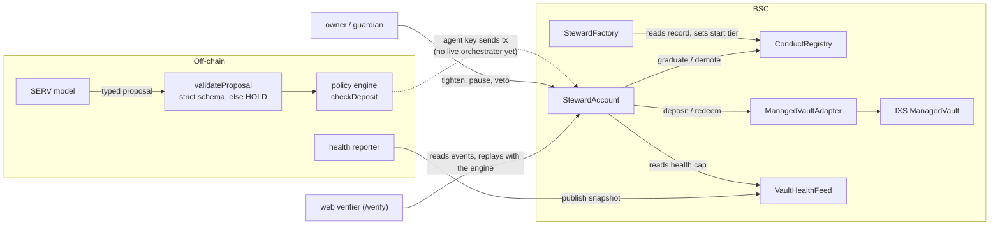

<p align="center">
  
</p>

<h1 align="center">Steward</h1>

<p align="center">
  <a href="https://github.com/Dami904/steward/actions/workflows/ci.yml"></a>
  <a href="#judge-fast-path"></a>
  <a href="LICENSE"></a>
  <a href="https://steward-rwa.vercel.app/demo"></a>
  <a href="https://testnet.bscscan.com/tx/0x9a8c292325043cdb5dfcde26616a99581f59e955cf7db82eb97f431b91492a8c"></a>
</p>

**An AI agent can propose moving money, but can it prove what it was allowed to do, and can it earn more room over time instead of being handed it?**

Steward is an OpenServ SERV Hackathon Edition 01 submission (RWA Vaults track, partner IXS
Finance). An AI agent proposes deposit and redeem actions on IXS's real `ManagedVault` on BSC
(`0xc975a3EeF2e49F8eDdEf585340C43f15300fCB82`). A deterministic policy engine, not the model,
decides what is allowed. The agent's limits are tiers it earns from a replayable on-chain
record of its own conduct, not constants an owner typed in. Vault liquidity is measured from
chain history, not taken from documentation.

**Unaudited. No real funds were spent and nothing is deployed to mainnet. Not financial
advice.** See [What is real and what is simulated](#what-is-real-and-what-is-simulated).

[Demo video](#demo-video) · [Judge fast path](#judge-fast-path) · [Core proof](#core-proof-two-agents-one-request) · [Known gaps](#known-gaps) · [Run it](#run-it-locally)

## Demo video

<!--
  VIDEO PLACEHOLDER. When the video is up, replace this block with a clickable thumbnail:
  [](https://youtu.be/VIDEO_ID)
  and fill in the chapter links below (https://youtu.be/VIDEO_ID?t=SECONDS).
-->

> **Video coming soon.** Until then, the same walkthrough runs live at
> [steward-rwa.vercel.app/demo](https://steward-rwa.vercel.app/demo).

Planned chapters:

| Time | Chapter |
|---|---|
| 0:00 | The problem: an AI agent with a wallet |
| 0:20 | A stranger agent asks to deposit 200 and is refused (`OverMaxTx`) |
| 0:45 | An agent with an earned record makes the same request and it goes through |
| 1:10 | Verify it yourself: `/verify` replays the record and re-checks the graduation |
| 1:40 | The same contrast on BscScan (testnet) |
| 2:00 | Measured liquidity: the real vault's redemption times, and its stale NAV |
| 2:30 | What is real, what is simulated, and what is not done |

What to watch for: the refused deposit and the accepted one are the same amount (200); the
only difference is the record each agent has on-chain.

## Judge fast path

| What | Number (re-run 2026-09-26) |
|---|---|
| Foundry tests (contracts, no network) | 89 passed, 0 failed |
| Off-chain tests (TS engine 27, Python engine 27, reference consumer 6, SERV client 28, web 8, demo-chain proxy 3, scripts 11) | 110 passed |
| Differential cases, TS vs. Python engine | 144 of 144 identical |
| Offline adversarial eval (deterministic defenses vs. synthetic model outputs; no live model) | 21 of 21 scenarios pass |
| **Live SERV eval** (`pnpm run live:eval`: 10 adversarial scenarios × 3 arms, 30 real calls to `gpt-5.4-mini` via SERV) | **0% unsafe in every arm** (no address, calldata or limit ever got past validation); full-defense arm 10 of 10 schema-valid with strict `response_format`; latency 0.9–2.4 s. Details: `docs/API_NOTES.md` |
| Halmos symbolic proofs of `PolicyMath` | 3 of 5 properties proved; the other 2 timed out and are fuzz-covered instead |
| **On a public explorer** (BSC testnet, mock vault; the real-vault run is the hosted fork) | Stranger B's 200 deposit: [**Fail**, `OverMaxTx`](https://testnet.bscscan.com/tx/0x9a8c292325043cdb5dfcde26616a99581f59e955cf7db82eb97f431b91492a8c). Graduated A's same 200: [success](https://testnet.bscscan.com/tx/0x68c778634069a96a3427fd8103bec969ccf144f855fb10d3383cd826f1467885). A's [graduation](https://testnet.bscscan.com/tx/0x7219ed454cbe5826a0abb0c4c8ddca41b9eefec12af04dd8867963fd4ceca286). All steps: `LIVE.md` |

Try it: **https://steward-rwa.vercel.app/demo** (no wallet needed). Every page works there. The
on-chain pages read the demo run's chain, served read-only from
`https://steward-demo-chain.onrender.com` (`deploy/demo-chain/`: the run's self-contained
Anvil state behind a proxy that refuses transactions and cheat methods). Hosted differences:
wallet controls on `/app` are off (the chain is read-only), the honeypot inbox is closed, and
the chain host sleeps when idle, so the first load after a quiet spell can take about a
minute. To run it all locally with no fork or key, see [Run it locally](#run-it-locally).

## Contents

[Demo video](#demo-video) · [Judge fast path](#judge-fast-path) · [Core proof](#core-proof-two-agents-one-request) ·
[The problem](#the-problem) · [What was built](#what-was-built) · [Architecture](#architecture) ·
[How it decides](#how-it-decides) · [Measured liquidity](#measured-vs-claimed-liquidity) ·
[Compared to](#compared-to) · [Engineering decisions](#engineering-decisions) ·
[Real vs. simulated](#what-is-real-and-what-is-simulated) · [Pages](#pages) ·
[Known gaps](#known-gaps) · [Tech stack](#tech-stack) · [Run it](#run-it-locally) ·
[Layout](#project-layout)

## The invariant

The model's output can never itself move funds or raise a limit. It emits a typed proposal
only; it never receives a code path that can name an address, produce calldata, set a limit or
raise capacity. Every increase in capacity or tier traces to a deterministic predicate over
on-chain state (`spec/accounting.md`, `spec/tiers.md`). Tightening is immediate; loosening is
owner-gated or veto-windowed. Every state-changing action is bound to a receipt (sequence
number plus policy-input hash), and an unreceipted action reverts.

## Core proof: two agents, one request

> Two agents with identical mandates ask to deposit the same 200 into the vault. One has an
> earned on-chain record; the other is new.

Verbatim output of the public BSC testnet run (`scripts/testnet-demo.ts`, 2026-09-26; mock
vault, since the real one is mainnet-only). Every link resolves on the explorer:

```text
[A_dwell] Waited out T0's 600s minimum dwell in real chain time
[A_graduate] Anyone calls graduate(): all six T0 conditions hold, Agent A goes T0 -> T1 -> ok https://testnet.bscscan.com/tx/0x7219ed454cbe5826a0abb0c4c8ddca41b9eefec12af04dd8867963fd4ceca286
[B_create] Agent B (a stranger with no record) created at T0: 0x8fb0e2699452ba78751b90b8d2bebf76ea472bba -> ok https://testnet.bscscan.com/tx/0x691276c5d667850260113a387dd1eeb4e80b34a556208630fd3ae926b2726be6
[B_fund] Agent B's account funded with 250 mock USDC -> ok https://testnet.bscscan.com/tx/0x9f34c03f03d14e4c7433e262d09e02612e9c1b78e76a55ab63317c9ba04a3e00
[A_contrast_deposit] Agent A (T1, max 300 per deposit) deposits 200: succeeds -> ok https://testnet.bscscan.com/tx/0x68c778634069a96a3427fd8103bec969ccf144f855fb10d3383cd826f1467885
[B_contrast_deposit] Agent B (T0, max 120 per deposit) tries the same 200: reverts on-chain (OverMaxTx) -> REVERTED https://testnet.bscscan.com/tx/0x9a8c292325043cdb5dfcde26616a99581f59e955cf7db82eb97f431b91492a8c
```

How to read it: before these lines, Agent A deposited 100 and logged 10 receipts (all in
`deploy/testnet/run.json`). `graduate()` can be called by anyone and succeeds only if the
account's own on-chain history meets every promotion condition, so A moved to T1 (300 per
deposit). B is a fresh account, still T0 (120 per deposit). Same request, different outcome,
and the only difference is the record. B's deposit was sent with a fixed gas limit on purpose so
the refusal is mined and visible, not stopped silently before sending.

The same sequence ran against the **real** IXS vault on a fork of BSC (`LIVE.md`), where it
was independently re-checked: `packages/engine`'s promotion function, fed the contract's own
on-chain state, agreed the graduation was legitimate. That run's chain is served read-only at
[steward-rwa.vercel.app](https://steward-rwa.vercel.app/demo); `/verify` replays it in the
browser. The real vault's NAV was stale on the day of that run, so it was re-set on the fork at
the unchanged price; `LIVE.md` says exactly how.

## The problem

Giving an AI agent a wallet is all-or-nothing today. Either it can move the money, and you trust
whatever it decides, or someone approves every step and it isn't really an agent. Spending caps
help, but they are numbers someone typed in: nothing ties them to how the agent has actually
behaved, and nobody outside can check what it was allowed to do. And in an RWA vault, "you can
redeem" says nothing about how long getting the cash back really takes.

## What was built

- **Contracts** (`contracts/src`): `StewardAccount` holds the funds and enforces the mandate,
  tier limits and receipts on every action; `StewardFactory` creates accounts and sets the
  starting tier from the agent's record; `ConductRegistry` keeps that record across accounts;
  `VaultHealthFeed` publishes measured vault liquidity; `ManagedVaultAdapter` talks to the IXS
  vault.
- **Policy engine** (`packages/engine`, mirrored in Python): the same rules off-chain, so every
  verdict can be computed before sending and re-checked after.
- **SERV client** (`packages/serv-client`): calls the model, and accepts only a typed proposal
  that passes a strict schema; anything else becomes HOLD.
- **Vault health measurement** (`scripts/live-health-snapshot.ts`): redemption latency read
  from the real vault's own request history.
- **Web app** (`apps/web`): a guided walkthrough, a verifier that replays any account's
  history, a no-wallet simulator, a live account view and the honeypot.

**The loop: the model proposes, the engine decides, the contract enforces and records a receipt,
and the record it builds is the only thing that can raise its limits.**

## Architecture



| Piece | Role |
|---|---|
| `contracts/src/StewardAccount.sol` | Holds USDC and vault shares. Every action needs the next sequence number and a receipt hash, else it reverts; deposits are checked against mandate, tier, health and hard caps. |
| `contracts/src/StewardFactory.sol` | Creates accounts; the starting tier comes from `ConductRegistry`, capped by the owner. |
| `contracts/src/ConductRegistry.sol` | Per-agent record: accounts, distinct owners, risk units, incidents. Only factory-created accounts can report. |
| `contracts/src/VaultHealthFeed.sol` | Registered reporters publish snapshots; consumers can only tighten from them. |
| `packages/engine` | The same rules off-chain (TypeScript; Python mirror for differential tests). |
| `packages/serv-client` | SERV transport and the strict proposal validator. |
| `apps/web` | Walkthrough, verifier, simulator, live account, honeypot. |

The dotted edge is honest: no orchestrator connects a live model to the agent key yet. The
demo's transactions are sent by `scripts/demo-driver.ts`; the model's side is tested
separately against live SERV (judge table above).

## How it decides

**Promotion** (`graduate()`, callable by anyone; `spec/tiers.md` §3). An agent moves up one
tier only if all of these hold on-chain:

1. It has spent the tier's minimum dwell time at the current tier.
2. It has carried enough risk over time (exposure × time).
3. Its peak exposure reached the required share of the tier's ceiling (it actually used what it
   was given).
4. It has logged the minimum number of receipts.
5. No incidents since entering the tier.
6. The account is not paused, the mandate hasn't expired, and evidence isn't stale.

**A deposit** is checked by the contract (and, before sending, by the engine):

| Situation | Outcome |
|---|---|
| Wrong sequence number (no valid receipt) | Revert `BadSequence` |
| Account paused, or mandate expired | Revert |
| Below the vault's minimum deposit (100) | Revert `BelowVaultMinimum` |
| Above the lower of the tier's and the mandate's per-deposit cap | Revert `OverMaxTx` |
| Over the daily action limit (lower of tier and mandate) | Revert `RateLimited` |
| Exposure after deposit above capacity: min(mandate cap, tier ceiling, health cap, owner cap, hard cap) | Revert `OverCapacity` |
| Would leave less than the reserve plus the mandate's minimum cash | Revert `BelowReserve` |
| Vault health snapshot stale, paused or code changed | Health cap 0: no new deposits (exits unaffected) |
| Vault p90 redemption time above the mandate's lead time, or drawdown ≥ 25% | Health cap halved |

**Tightening** (by agent, guardian or the health feed) applies immediately. **Loosening** is
either the owner's or waits out a delay the owner or guardian can veto. An owner pause or a
vetoed loosen is an incident and demotes the agent.

## Measured vs. claimed liquidity

`docs/measurement-report.md`, re-taken 2026-09-24 from the real vault's full request history
(method `REQUEST_FINALIZE_VIEW`). Of the 8 redemption requests ever made, 6 settled (p50 about
0.26 hours, slowest 12.7 days) and **2 are still pending after 63 and 107 days**. The
percentile counts only settled requests, so 12.7 days understates the tail. Compass's docs say
only that the operator settles "within a defined window" and give no number, so the report
states what was measured and does not claim the docs are wrong. n = 6 settled is small, and
one of the two pending requests is dust (0.1 share).

## Compared to

Each row below was read on 2026-09-24 from the project's own README, the vendor's docs, or
(for WAIaaS) its maintainer's write-up. That is a check of what they say they do, not an audit
of their code, and the search behind it was a handful of queries, not a survey.

| Project | What it does, per its own docs | What differs here |
|---|---|---|
| [Warden](https://github.com/AtmegaBuzz/warden) | 19 rules: per-transaction and daily/weekly caps, allowlists, cooldowns, anomaly scoring in an off-chain TypeScript engine; spending limits and recipient allowlists enforced on-chain through EIP-7702 (`PolicyDelegate.sol`); an audit log behind an MCP tool and dashboard. Limits are mostly static; a `rampUpPolicy` template raises them over time. | The agent's tier limits rise only when a predicate over the account's own on-chain exposure history holds, and fall on incidents; time alone never raises them (an owner can still loosen limits by hand). Verdicts and policy inputs are emitted on-chain and replayable without an operator's log. |
| [WAIaaS](https://github.com/waiaas/WAIaaS) `REPUTATION_THRESHOLD` | Blocks an agent whose ERC-8004 reputation score is below a threshold. Tiered thresholds map the score and the transaction size to INSTANT / NOTIFY / DELAY / APPROVAL handling. | The input here is the account's own conduct record, not other parties' feedback (the real ERC-8004 registry rejects self-feedback, so this repo only registers an identity). The output is the contract's own per-transaction, per-vault and tier limits, not an approval workflow. |
| [seedless-agent-wallet](https://github.com/francis-codex/seedless-agent-wallet) (Solana; one of many similar projects) | On-chain Anchor program: per-transaction limit, daily limit, cooldown, kill switch. The owner sets the limits with a `set-policy` command. | Same class of on-chain caps. Here the target is EVM and one RWA vault, limits are earned rather than owner-set, and there is a measured redemption-latency feed. |
| Coinbase CDP wallet policies (AgentKit's wallet layer; [docs](https://docs.cdp.coinbase.com/server-wallets/v2/using-the-wallet-api/policies/evm-policies)) | Policy rules with criteria such as `ethValue` limits and `evmAddress` allow/deny lists on `signEvmTransaction`, set per project or per account. | Those caps are operator-configured. Here the tier that sets the caps is computed from replayable history. This repo does not compete on key custody: the owner key is a plain key in this build. |
| NAV oracles (Chainlink-style feeds; RedStone Settle) | Publish what a share is worth. I found no public feed of measured per-vault redemption latency (limited search). | Health feed: how long redemption actually takes, recomputed from the vault's own request history. Settled requests only; see the caveat above. |

Not a moat. On-chain caps, allowlists, kill switches, audit trails and reputation-conditioned
access all exist in the projects above, and Warden already ships a template that raises limits
over time. What this repo adds is narrower: tier limits that rise only on a deterministic
predicate over replayable on-chain history and fall on incidents, plus a measured-liquidity
feed for one RWA vault. Novelty beyond that is unproven. The plan's original prior-art notes also named
"Phalnx" and an on-chain "agentshield"; neither could be found, so neither is listed.

## Engineering decisions

- **The contract, not the model, is the enforcer.** The engine exists to predict and explain
  verdicts; the contract re-checks everything, so a wrong or manipulated model output can at
  worst fail to act.
- **Authority from conduct, not configuration.** Limits rise only through `graduate()`, a
  predicate over the account's own history that anyone can call and anyone can replay. Time
  alone never raises them.
- **Tighten-only feeds.** The health feed can only lower capacity. A dead or malicious reporter
  can stop new risk, never add it.
- **Two engines, byte-for-byte.** The policy engine exists in TypeScript and Python and 144
  shared cases must agree exactly. It does not catch a mistake made in both (it missed one; see
  known gaps), so the contract stays the authority.
- **Measure, don't quote.** Redemption latency comes from the vault's own request history, and
  the method and sample size are published with it.
- **Zero funds, stated plainly.** Real-vault behaviour runs on a fork and the explorer proof on
  testnet, rather than putting real money at risk for a hackathon.

## What is real and what is simulated

- **Real:** the contracts and their tests; the policy engine (TypeScript and Python, checked
  against each other); every transaction in the demo run (`LIVE.md`), executed against the real
  IXS vault's code and state on a local fork of BSC; the same two-agent contrast on the public
  BSC testnet; the vault liquidity measurement, read from live BSC; the live SERV model eval;
  the ERC-8004 identity registration (fork-tested against the live registry); an x402 payment
  on Base Sepolia confirmed by an on-chain balance check.
- **Simulated or staged:** the USDC balances on the fork (impersonated from a public holder,
  local only); demo-speed tier schedules; the testnet run's vault (a mock, since the real one is
  mainnet-only); and one change to the real vault on the fork: its NAV was stale on the day of
  the run, so it was re-set at the unchanged price (`LIVE.md`).
- **Not done:** a live model driving the agent (the demo's actions are scripted; the model's
  output is validated, not executed), a funded public honeypot, any mainnet deployment.

## Pages

| Page | What it shows |
|---|---|
| [`/demo`](https://steward-rwa.vercel.app/demo) | The guided walkthrough: stranger refused, earned agent accepted, then verify |
| [`/verify`](https://steward-rwa.vercel.app/verify) | Replays an account's on-chain history with the engine and checks every tier change |
| [`/simulate`](https://steward-rwa.vercel.app/simulate) | Move the inputs and watch the engine's verdict change; no wallet |
| [`/app`](https://steward-rwa.vercel.app/app) | An account's capacity, mandate, decision feed and a pre-flight check (wallet controls run locally) |
| [`/honeypot`](https://steward-rwa.vercel.app/honeypot) | The account scored against the honeypot categories (the inbox runs locally) |
| [`/`](https://steward-rwa.vercel.app) | Overview, with the real vault's redemption times read live |

## Known gaps

- **The model does not drive the demo.** No orchestrator connects a live SERV model to the
  contracts yet; the model's side is tested separately (live eval above).
- **Honeypot not run.** The inbox and leaderboard are built; there was no prize pot, no live
  model reading notices and no public attempts, so there are no fooled-rate numbers.
- **The health feed counts settled redemptions only**, so it understates the tail while
  requests sit pending (two on the real vault).
- **One pending redemption per account.** If the vault operator never settles it, that account
  cannot redeem again; the real vault has two requests in that state today.
- **Halmos:** 2 of 5 `PolicyMath` properties are fuzzed, not proved.
- **Not built:** multi-vault (Compass lists one IXS vault), the Finance District adapter.
- **Not verified:** model reasoning quality, owner key security, Sybil resistance.

Full list: `docs/LIMITATIONS.md`. Trust and key compromise: `docs/THREAT_MODEL.md`.

## Tech stack

- **Contracts:** Solidity 0.8.28, Foundry 1.8.3 (unit, fuzzed invariants, fork tests), Halmos,
  OpenZeppelin.
- **Engine and tooling:** TypeScript (run unbuilt with Node 22's type stripping), Python 3 with
  pytest, pnpm workspaces.
- **Web:** Next.js 16, React 19, viem, Playwright; hosted on Vercel.
- **Demo chain:** Anvil state behind a small Node proxy, in Docker on Render.
- **External:** OpenServ SERV (model calls), IXS `ManagedVault` on BSC, Compass API, ERC-8004
  registries, x402 (`@x402/next`, `@x402/fetch`) on Base Sepolia.

## Run it locally

Prerequisites: Node.js 22.6 or later, [pnpm](https://pnpm.io) (pinned in `package.json`;
`corepack enable` resolves it), Python 3.12+ with pytest, and
[Foundry](https://getfoundry.sh). No API key, wallet or network access is needed for the
default path.

```bash
git clone https://github.com/Dami904/steward.git && cd steward
pnpm install
pip install -r packages/engine-py/requirements.txt
bash contracts/setup.sh          # fetches forge-std and OpenZeppelin into contracts/lib

# The checks CI runs
pnpm lint && pnpm typecheck && pnpm test && pnpm build
(cd contracts && forge build && forge test --no-match-path "test/fork/*.t.sol")

# The whole site against the demo run's chain, no fork or key needed
make demo-chain                  # serves the run's chain on 127.0.0.1:8546
cd apps/web && pnpm dev          # then open http://localhost:3000/demo
```

`pnpm test` runs the TypeScript and Python engine tests, the reference consumer's tests, the
SERV client tests (mocked HTTP), the web and demo-chain unit tests, the script tests, and the
differential suite (144 cases, both engines must agree byte for byte).

Optional commands that touch a network (never run in CI):

| Command | Needs | What it does |
|---|---|---|
| `make fork-test` | network, `BSC_RPC_URL` (public) | Checks a contract can still deposit into the real vault. Read-only. |
| `make measure-health` | network | Live health snapshot of the real vault. Read-only. |
| `make live-serv-probe`, `make live-eval` | `SERV_API_KEY` | Real, billed SERV calls; see `docs/API_NOTES.md`. |
| `make fork-node`, `make deploy-demo`, `make demo-graduation`, `make verify-live` | network | Re-run the demo on a fresh fork and re-verify it (`LIVE.md`). |
| `make deploy-testnet-keys`, `make deploy-testnet-demo` | test BNB from a faucet | Re-run the demo on BSC testnet (`scripts/testnet-demo.ts`). |
| `make live-x402-payment-test` | funded Base Sepolia test wallet | A real x402 payment against `/api/verify-paid`. |

The `/app` wallet controls need a wallet pointed at a local chain; `apps/web/e2e/mock-wallet.ts`
and `contracts/script/DeployLocalMock.s.sol` explain the local setup their browser tests use.

## Project layout

```text
contracts/src/            StewardAccount, StewardFactory, ConductRegistry, VaultHealthFeed,
                          ManagedVaultAdapter, ERC8004IdentityBridge, libraries
contracts/test/           unit, invariant (fuzzed), fork (real vault and registry), halmos
contracts/script/         demo deploys: fork (DeployDemo), testnet (DeployTestnet), local mock
packages/engine/          TypeScript policy engine: capacity, tiers, health, evidence
packages/engine-py/       Python mirror of the engine, for the differential suite
packages/serv-client/     SERV client: transport, strict proposal validation, claim extraction
fixtures/differential/    shared test vectors for both engines
eval/                     adversarial scenarios for the offline and live evals
examples/naive-agent/     independent consumer of the health feed (no Steward code)
apps/web/                 Next.js site: /demo, /verify, /simulate, /app, /honeypot, and the
                          x402-priced /api/verify-paid
apps/web/e2e/             Playwright browser tests
deploy/demo-chain/        the demo run's chain state and the read-only proxy (hosted on Render)
deploy/testnet/           the public testnet run: addresses and every transaction
scripts/                  demo drivers, replay, live probes, fixture generators
spec/                     the rules the engine and contracts implement
docs/                     limitations, threat model, API notes, measurement report
LIVE.md                   what the demo run did, and how to check it
```

## Attribution

Built with Claude Code (Claude) as a coding agent under human direction. Depends on IXS
Finance's `ManagedVault`, the Compass API, OpenServ SERV, ERC-8004 registries, x402
(`@x402/next`, `@x402/fetch`), OpenZeppelin, Foundry, Halmos, Next.js and Playwright.

## License

[MIT](LICENSE), copyright 2026 Dami904. The contracts' `SPDX-License-Identifier: MIT` headers
match.
